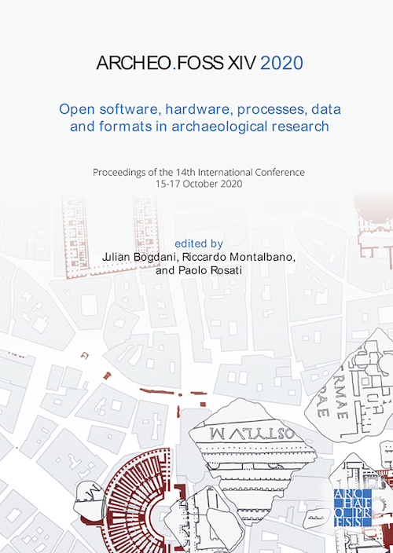

## Conference proceedings

{:.img-fluid}

The proceedings of the 14th edition of ArcheoFOSS conference have been published by Archaeopress as open-access and in print. The open-acces (CC BY-SA-NC) PDF can be donwloaded at [Archaeopress.com](https://www.archaeopress.com/Archaeopress/Products/9781803271248).

**Bogdani, Julian, Riccardo Mantalbano, and Paolo Rosati. eds. 2021. _ArcheoFOSS XIV 2020: Open Software, Hardware, Processes, Data and Formats in Archaeological Research_. Oxford: Archaeopress.**

Paperback; 174x245mm; 204pp; Illustrated in colour throughout. Papers in Italian and English. Print RRP: £38.00. 796 2021. Available both in print and Open Access. Printed ISBN 9781803271248. Epublication ISBN 9781803271255

During the 2021 edition works it will be possible to order a copy of the printed version and benefit of the special offer of **£28.50** instead of the full price of £38.00. Please use [this offer-leaflet](/images/2020/AA Bogdani pre-order offer.pdf) to order your volume now!

### Table of contents

- Foreword (p. iii)
- ArcheoFOSS 2020 Committees (p. v)

**Use, Application and Development of Free/Libre and Open-Source (FLOS) Tools in Archaeology**

- Michele **Pellegrino**, Donato **Coppola**.  
*Strumenti digitali open-source per la documentazione della cultura visuale paleo-mesolitica: dati preliminari da un flusso di lavoro sulle decorazioni incise su supporto calcareo dalla Grotta di Santa Maria di Agnano (Ostuni, BR)* (pp. 1-12)
- Stefano **De Angeli**, Fabiana **Battistin**, Federico Valerio **Moresi**, Philip **Fayad**, Matteo **Serpetti**  
*Valutazione integrata delle dinamiche di rischio di erosione del suolo in presenza di depositi archeologici. Il metodo proposto dal progetto RESEARCH (REmote SEnsing techniques for ARCHaeology)* (p. 13-23)
- Emanuele **Brienza**, Giovanni **Caratelli**, Lorenzo **Fornaciari**, Cecilia **Giorgi**  
*Rome – NE Palatine slopes: open-source methodologies and tools for the analysis of
ancient architectures* (24-34)
- Gabriele **Ciccone**  
*Un workflow open-source per l’elaborazione delle immagini termiche da drone* (35-43)
- Renatata **Ago**, Domizia **D’Erasmo**  
*Analysis of urban mobility in 18th-century Rome: a research approach through GIS platform* (44-54)
- Filippo **Diara**, Fulvio **Rinaudo**  
*Towards FreeCAD experimentation and validation as a FOS HBIM platform for building archaeology purposes* (55-67)
- Paolo **Rosati**  
*FLOS for Museums: open solutions to train communities and manage heritage sites* (68-78)
- Augusto **Palombini**  
*The virtual countryman. A GRASS-GIS tool for ancient cultivation recognition* (79-89)
- Timo **Homburg**, Florian **Thiery**  
*Little Minions and SPARQL Unicorns as tools for archaeology* (pp. 90-100)

**Creation, use and Promotion of Open Data and Open Formats in Archaeology**

- Francesca **Anichini**, Gabriele **Gattiglia**  
*The ArchAIDE Archive: the open-data policy and management of material covered by copyright* (pp. 101-107)
- Mirella **Serlorenzi**, Ascanio **D’Andrea**, Riccardo **Montalbano**  
*SITAR: a new open-data infrastructure for a public archaeology of Rome* (pp. 108-118)
- Florian **Thiery**, Sophie C. **Schmidt**, Timo **Homburg**  
*SPARQLing Publication of Irish ᚑᚌᚆᚐᚋ – Ogham Stones as LOD* (pp. 119-127)
- Nicola **Laneri**, Rodolfo **Brancato**, Salvatore **Cristofaro**, Marianna **Figuera**, Marianna **Nicolosi**  
*Towards an ontology of the Museum of Archaeology of the University of Catania: from the digitization of the legacy data to the Semantic Web* (pp. 128-137)
- Julian **Bogdani**  
*Fieldnotes for the development and publication of open standards for the vectorisation of archaeologic and architectonic topographic legacy data* (pp. 138-147)
- Andrea **D’Andrea**, Francesca **Forte**  
*Analysis and comparison of open and non-open spatial formats for archaeological research* (pp. 148-157)
- Alessandra **Caravale**, Alessandra **Piergrossi**, Irene **Rossi**  
*Open Data, Open Knowledge, Open Science: The new research group at the Institute of Heritage Science (CNR)* (p. 158-167)
- Marco **Ciurcina**, Piergiovanna **Grossi**  
*FOSS, Open-Data e archeologia: qualche riflessione su passato, presente e prospettive future* (pp. 168-177)

**Appendix**

- Julian **Bogdani**, Federico **Sciacca**  
*An introspective, incomplete, view on the activity of the FLOS community dealing with Archaeology and Cultural Heritage* (pp. 178-192)

---

## Book of abstracts

The **Book of Abstracts** is freely available (golden open access, CC BY-SA 4.0) since 26/08/2020 in Zenodo .

### License

All the contents will be published under a [Creative Commons Attribution International (CC BY International)](https://creativecommons.org/licenses/by/4.0/) license.
