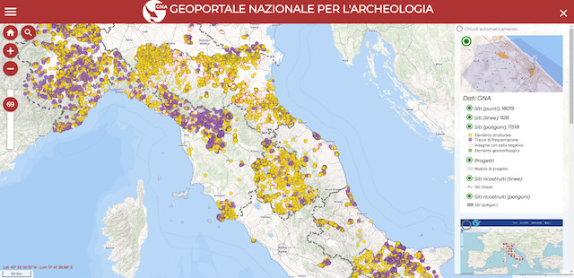
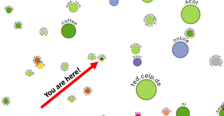
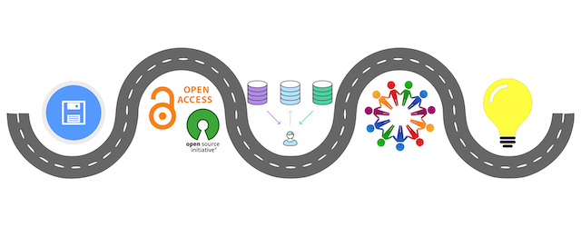

All panel proposals are published here, so everyone can comment and make suggestions on the various proposals.
The deadline for comments is **September 15th**. You can comment by submitting an email to [callforpaper@archeofoss.org](mailto:callforpaper@archeofoss.org). Comments may be shared with panel proponents and members of the scientific committee.

## 1. Tools, objectives, users: state of art and future perspectives on the sharing of open data in archaeology

- **Proponents**:
  - [Valeria Boi](mailto:valeria.boi@cultura.gov.it), MiC – Istituto Centrale per l’Archeologia
  - [Mirella Serlorenzi](mailto:mirella.serlorenzi@cultura.gov.it), MiC – SSABAP-RM

The panel aims to develop considerations about the methodological tools and the consequences of the Data Opening in archaeology, since the newly started experience of the on-line publication of the National Geoportal for Archaeology, and from other consolidated and already ongoing experiences in Italy (for example, the SITAR project, of the Special Superintendency of Rome, the MOD designed by the University of Pisa, more recently the ArcheoDB of Emilia Romagna, to name just a few).
Approaching balances, prospectives and an exam of the various criticisms, the panel intends to trace a sort of “roadmap”, considering the main issues about the Open Data raised by the sector operators, which will be useful for future developments:

Who is useful to the Open Data in archaeology? Which is the added value for their accessibility online, without discrimination?
Is it necessary to share also the original scientific documentation in addition to the basic data? What level of detail is desirable, both for the representation of the data and for their description? How can shared vocabularies make it easier to find and compare data?
How is it possible to balance the exigence of enhancing the authors’ rights with that of the data validation by an Istitution? In this sense, an in-depth reflection on the structure and role of metadata is desirable.
In a world now used to the real-time updating of the information, is a dynamic archaeological map, constantly updated with new findings or with new adjourned interpretations, concretely achievable or is it just utopic?
Which is the sustainable way to trace properly a circular knowledge path? And how can the adoption of shared standards be extended at national level, to improve the data quality and compare and spread them as best? How is it possible to reconcile the need for a central collection point with the specificities of other existing projects?

## 2. archaeo.social: archaeology in the Fediverse and the future of scholarly social media 

- **Proponents**:
  - [Joe Roe](mailto:joeroe@hey.com), University of Bern, ORCID: 0000-0002-1011-1244 
  - [Zack Batist](z.batist@mail.utoronto.ca), University of Toronto, ORCID: 0000-0003-0435-508X 

In November 2022, the microblogging service Twitter (now X) was acquired by billionaire Elon Musk, triggering the first of several exoduses of its users. Amongst those who left the site for other platforms, or who simply stopped using it, were archaeologists and other scientists. ‘Science Twitter’ had been a prominent venue for scholarly communication on social media, providing a platform for researchers to talk directly to each other and to the public (Cheplygina et al. 2020). Its sudden disintegration was a wake-up call for many, highlighting the risks of entrusting public scientific discourse to a single private corporation. 

Amongst several alternatives, Mastodon emerged as the primary destination for scholars leav ing Twitter (Insall 2023). Mastodon is similar to Twitter in its design and function, but rather than being controlled by a single corporation, it is a decentralised network of individual servers based on free and open source software. Servers ‘federate’ with each other using an open, W3C standardised protocol (ActivityPub), allowing communication across Mastodon instances and a wider ‘Fediverse’ of interoperable services. The Fediverse presents a golden opportunity for scholars to reclaim ownership over the infrastructure that supports their participation on social media, and other aspects of their online experiences, too (Brembs et al. 2023). We cre ated archaeo.social to encourage the use of federated social media for scholarly communication in archaeology. As of August 2023, it has 675 users, though many more archaeologists are registered with other servers in the Fediverse (Shilobod, Titolo, and Visser 2023). 
The aim of this panel is to critically examine this nascent community and the role of the Fedi verse in the future of scholarly communication. We invite discussion of the use and potential of decentralised social media for archaeology; of risks, challenges, and critiques; and reflections on the future trajectory of archaeo.social and archaeology in the Fediverse more broadly. 

### References 
- Brembs, Björn, Adrian Lenardic, Peter Murray-Rust, Leslie Chan, and Dasapta Erwin Irawan. 2023. “Mastodon over Mammon: Towards Publicly Owned Scholarly Knowledge.” Royal Society Open Science 10 (7): 230207. https://doi.org/10.1098/rsos.230207.
- Cheplygina, Veronika, Felienne Hermans, Casper Albers, Natalia Bielczyk, and Ionica Smeets. 2020. “Ten Simple Rules for Getting Started on Twitter as a Scientist.” PLoS Computa tional Biology 16 (2): e1007513. https://doi.org/10.1371/journal.pcbi.1007513. 
- Insall, Robert. 2023. “Science Twitter — Navigating Change in Science Communication.” Nature Reviews Molecular Cell Biology 24 (5, 5): 305–6. https://doi.org/10.1038/s41580- 023-00581-3. 
- Shilobod, Nika, Andrea Titolo, and Ronald Visser. 2023. “Archaeologists of Mastodon.” August 2, 2023. https://stark1tty.github.io/Mastodon-Archaeology/.

## 3. The Roadmap to Cooperation and Transparency: Fostering Open Science Solutions in Archaeology 
 - **Proponents**:

   
   
   - [Alessio Palmisano](mailto:alessio.palmisano@unito.it), University of Turin
   - [Andrea Titolo](mailto:andrea.titolo@unito.it), University of Turin

The field of archaeology has experienced a transformative shift in recent years, spurred by a growing deluge of novel digital data about the human past accessible through fieldwork reports, 3D models of artefacts, transcriptions of historical documents, databases and open repositories of datasets (Bevan 2015). In this context, archaeology, as a discipline relying on empirical methods in data collection and analysis, has to deal with several new challenges.

Do the available datasets adhere to the FAIR principles of scientific data management and stewardship?
To what extent is scientific research reproducible?
What are some optimal strategies for long-term preservation of digital archaeological data?
What are the ethical issues arising from fieldwork and data dissemination practices?

By embracing principles of transparency, reproducibility, and collaboration, open science has reshaped the way archaeological research is conducted, communicated, and valued within the scholarly community and beyond (Marwick et al. 2017). The advantages of open science are evident in its ability to foster interdisciplinary collaborations, enhance data accessibility and dissemination, promote scientific rigour and democratize access to knowledge. However, the implementation of Open Science practices in archaeology has also paved the way for new issues that need to be carefully scrutinised. Those issues are related to intellectual property rights, ethical concerns surrounding sensitive cultural heritage, data management strategies, scientific publication modalities, and the need for adequate training to ensure the effective adoption of open science principles (Cole et al. 2022).

We welcome papers and case studies illustrating relevant data, approaches, theoretical frameworks and ethics to data sharing and reproducible research applied to archaeological case studies. Furthermore, in this panel, we would like to discuss possible solutions and strategies to adopt for the establishment of standardised protocols for data sharing and stewardship. 

### References

- Bevan, A., 2015. The data deluge. Antiquity, 89(348), 1473-1484.
- Cole, N. L., Reichmann, S., and Ross-Hellauer, T., 2022. Global Thinking. ON-MERRIT recommendations for maximising equity in open and responsible research (1.0). Zenodo. https://doi.org/10.5281/zenodo.6276753
- Marwick, B., d’Alpoim Guedes, J., Barton, C. M., Bates, L. A., Baxter, M., Bevan, A., ... & Wren, C. D. (2017). Open science in archaeology. SAA Archaeological Record, 17(4), 8-14.

## 4. Virtual Reconstruction in Archaeology with FOSS methods and tools

 - **Proponents**:
   - [Emanuel Demetrescu](mailto:emanuel.demetrescu@cnr.it), ISPC-CNR
   - [Simone Berto](mailto:simone.berto@ispc.cnr.it), ISPC-CNR

Virtual reconstructions in archaeology used to be evaluated primarily as an enhancement tool (with a purely aesthetic focus). Recently this idea is evolving, and semantic 3D models are considered an indispensable instrument for analyzing, creating hypotheses, and synthesizing archaeological study. 

More, Virtual Reconstruction is a combination of a variety of sources, ranging from survey to images to previous studies and interpretations with a diverse degree of reliability: for its intrinsic nature, to be recognized as a scientific practice, it should be closely connected to the Open Science paradigm through FOSS solutions.
This panel offers a place to present original works in which reconstruction is part of scientific archaeological study. Virtual reconstruction includes highly fragmented contexts, contexts that no longer exist as well as design images that have never been realized. The use of open software, formats, and workflows, in line with the principles of Open Science and FAIR, provides an essential opportunity to demystify the reconstructive process, make it replicable, transparent, and reusable by other researchers. The panel includes theoretical-methodological contributions and practical case studies on the use of virtual reconstruction methodologies, hypothesis editing tools within three-dimensional environments or purely semantic representations.

Main topics include but are not limited to:

Application of FAIR and Open-Source principles to reconstruction processes.
Inter and trans-disciplinary approaches to documenting archaeological contexts.
Semantic 3D tools for mapping, representing, and sharing virtual reconstructions together with related information.
Solutions to create explore measure virtual reconstructions in archaeology.

## 5. Small Finds: comparing methodologies and techniques for the 3D scanning of small 

 - **Proponents**:
   - [Daniele Bursich](mailto:daniele.bursich@univr.it), University of Verona
   - [Dario Calomino](mailto:dario.calomino@univr.it ), University of Verona
   

The current state of research in archaeology relies of very wide range of options for approaching the  3D scanning of ancient artefacts from active, passive or hybrid sensors. There is plenty of case studies  on the application of different procedures, more or less automatised and dealing with different classes  of objects and structures.  

However, the 3D scanning of small objects is more uncommon and a slightly underdeveloped field of  research, as we are often struggling with several unresolved issues. This is particularly the case with  glossy or translucid materials, such as different kinds of stones in which gems, intaglios and cameos  were carved, and precious metals used for striking coins in antiquity, having either extremely reflective  surfaces (gold and silver) or light-absorbing ones (copper and bronze). Due to these hindrances, we  must sometimes resort to re-modelling an object from scratch/images rather than actually scans it,  and sometimes this is not even an option. Three-dimensional imaging in the numismatic field can be  a game-changing opportunity to acquire vital information from coins to determine their conservation  status, their authenticity and even their date. In the museum environment and in teaching activities it  can be also used to show super-high-resolution images of small objects (for instance gems or ring seals) to appreciate details of their fabric and/or designs for display and visual-learning activities. Organic approaches in this field are very uncommon, as we often rely on post-production software and  we lack sound and reliable methodologies for acquiring large set of data in batch (for instance in the  scanning of coin hoards). 

This panel is organised within the scope of the IRIMES Project (The Roman Imperial Image between  Coinage and Sculpture – FARE prot. R2035CJB5, funded by the Italian Ministry of Research), based in  the Department of Cultures and Civilisations at the University of Verona. It aims to investigate how the  3D scanning of small ancient artefacts can enhance our ability to study and understand the information  that they provide. The panel wishes to find out more about current research in this specific field and  to discuss and compare different experiences.  

We welcome presentations dealing with the 3D scanning of small objects, especially glyptic, jewellery  and coins, discussing: how different techniques, tools and software can be combined to generate new  methodologies and research strategies that will produce the most effective results in this field; how  these new approaches can be deployed also to engage with the general public outside the academia  for dissemination purposes and for display activities in museums.

### References

- Carcagni, Daffara et al. 2005 = P. Carcagnì, C. Daffara et alii.‘Optical micro-profilometry for archaeology’,  Proc. SPIE 5857, 58570F (2005) 
- Colombo, Daffara et al. 2007 = C. Colombo, C. Daffara et alii, ‘Evaluation by laser micro-profilometry of  morphological changes induced on stone materials by laser cleaning’, Springer Proc. in Physics 116 (2007): 523-56 
- Egger et al. 2020 = B. Egger et alii ‘3D Moprhable Face Models – Past, Present and Future”, ACM  Transaction on Graphics Vol. 39, n. 5 (2020) 
- Fontana et al. 2004 = R. Fontana et alii, ‘High-resolution 3D survey of artworks’, Proc. SPIE 5457 (2004):  719-26. 
- Giachetti et al 2018 = A. Giachetti et alii, ‘A novel framework for highlight reflectance transformation  imaging’, Computer Vision and Image Understanding 168 (2018): 118-31. 
- Montani et al. 2012 = I. Montani et alii, ‘Analysis of Roman pottery graffiti by high resolution capture  and 3D laser profilometry’, Journal of Archaeological Science 39 (2012): 3349–53. 
- Ranjan et al. 2018 = A. Ranjan et alii, ‘Generating 3D face using Convolutional Mesh Autoencoders’,  ECCV (2018). 
- Zhongping et al. 2021 = Zhongping et alii, ‘Fast Bas-relief Generation from 3D Scenes’, Computer-Aided  Design Vol 130 (2021)

  ## 6.   Data Integration and Communication Platforms

- **Proponents**:
 - [Marco Montanari](mailto:marco.montanari@openhistorymap.org), OpenHistoryMap
 - [Lucia Marsicano](mailto:lucia.marsicano@openhistorymap.org), OpenHistoryMap

Archaeology has always been under pressure by two, in part opposing, forces: academic collection and sharing of data, which requires high quality and verticality, and, on the other side of the barricade, public communication of the discovered data, where quality is not paramount, while its aspects of simplicity, context and readability become important. As we all know, the field has always relied on geographic information, photographic data and field collection. From this point of view technology has aided in many aspects. For this reason, GIS has been applied in archaeology for the last three decades. Open source softwares like for example QGis and Grass enable a wide variety of analyses, while server applications like QField and PyArchInit give the systems additional input and output for academia.

On the other side there are several attempts to share data for the public, like SITAR, Wikimedia Commons, Open Context and many other projects, that share a common set of features: these projects are either very local (i.e. SITAR), very vertical on a specific topic (i.e. Open Context)or vertical on specific data formats (i.e. Wikimedia Commons). In certain cases, there is also the issue of data quality, as some datasets are not validated and completely public knowledge driven (i.e. Wikidata). Project-specific WebGIS solutions are widely adopted approaches also thanks to their most important feature: standardization.

The potential space for containers for public archaeology, public history as well as storytelling integrations towards other platforms where the narrative is central appears to be wide open and without many attempts to tackle the concept, beside very technical platforms (i.e. Github, Zenodo). Within this panel we would like to explore platforms that cross knowledge sharing and data quality, where academia and research groups are central, but so is also communication, in the
long-term idea to help increase cooperation and standardization between operators.

