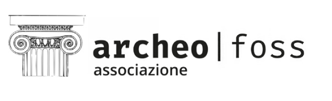

We are very happy to publish the definitive conference programme of ArcheoFOSS 2023, to be held **in Turin** and **online** on 12-13 December 2023.

Please, feel free to contact us anytime by sending an email at [callforpaper@archeofoss.org](mailto:callforpaper@archeofoss.org).

---
[Download the ArcheoFOSS 2023 programme (PDF)](./ARCHEOFOSS 2023 PROGRAM DECEMBER.pdf) [last update 2023-12-02]

---

ArcheoFOSS 2023 is hosted by the **Dipartimento di Studi Storici and the Scuola di specializzazione in Beni archeologici
Giorgio Gullini** of the Università di Torino, with the contribution of **Direzione Generale Educazione, Ricerca e Istituti Culturali. Ministero della Cultura**.

    

        
    

    

        
    

    

        
    

---

## Venue

Department of Historical Studies, University of Turin
Palazzo Nuovo, Via Sant’Ottavio 20, Torino
Aula Terracini (Ground floor)

## 12 December 2023

9.00 _Greetings_ Gianluca Cuniberti, Vito Messina
9.15 _Introduction_ Anna Maria Marras, Rosina Leone, Alessio Palmisano 

### 9.30-11.00 Plenary session

Chiara Bonacchi, University of Edinburgh
Elena Giglia, Open Science Unity, University of Turin
Elena Marangoni, Oriana Bozzanelli, Wikimedia Italy, University of Turin

### 11.00-11.30 Coffee break

_Round table of use and reuse of images and digital contents in Heritage_

### 13.00 – 14.00 Lunch break 

### 14.00 – 16.00 Panel Session 1: _Tools, objectives, users: state of art and future perspectives on the sharing of open data in archaeology_, Valeria Boi, Mirella Serlorenzi. 

- _Data Opening in Archaeology: A Roadmap_, Elena Calandra, Valeria Acconcia, Valeria Boi, Ilaria Di Cocco, Annalisa Falcone, Mirella Serlorenzi. 
- _Managing Archaeological Data for a Sustainable Governance of Heritage_ Francesca Anichini, Antonio Campus, Gabriele Gattiglia, Antonella Rosa Saponara.
- _The DSC authority file: a link between fieldwork and finds_, Stefano Costa, Eleonora Fornelli, Anna Lorenzatto, Gennaro Iovino, Chiara Panelli, Fiorenza Proto, Renata Esposito.
- _Does not compute! Accounting for social and situated experiences while integrating and analyzing obsidian sourcing data_, Zachary Batist.
- _An easy and open way to publish geographical open dataset from QGIS to Kepler.gl: the MirrorLab WebGIS case study_, Francesco Freddolini, Vincenzo Maria Lacolla, Saverio Giulio Malatesta, Maria Onori, Antonio Pugliano, Paolo Rosati. 
- _Entertainment buildings in the roman empire: a quantitative approach_, Lucia Marsicano, Marco Montanari, Open History Map.
- _Sharing (Linked) Open Data with domain-specific data-driven community hubs on the example of the German National Research Data_ Infrastructure (NFDI) consortium NFDI4Objects and the data hub archaeology.link, Florian Thiery, Allard Mees

### 16.00 -16.30 Coffee break

### 16.30 – 17.00 Panel session 2:  _Archaeo.social: archaeology in the Fediverse and the future of scholarly social media_, Joe Roe, Zack Batist

- _Media deconvergence and digital public archaeology_, Lorna-Jane Richardson
- _On the pessimistic side: Is the fediverse a viable alternative to X for Spanish researchers?_ María Coto-Sarmiento
- _Making and Breaking: Anarchist Praxis, Archaeological Communities, and Social Media_, Judit del Río, Aris Politopoulos, Colleen Morgan

### 17.00-19.00 Galleria Archeologica- Musei Reali

## 13 December

### 9.00- 11.00 Panel session 3: _The Roadmap to Cooperation and Transparency: Fostering Open Science Solutions in Archaeology_, Alessio Palmisano, Andrea Titolo

- _The Good, the Bad and the Ugly: Evaluating Open Science Practices in Archaeology_, Alessio Palmisano, Andrea Titolo.
- _The (open) BE-ARCHAEO database: a tool for interdisciplinary research on archaeological sites_, Monica Gulmini, Vincenzo Lombardo.
- _Citizen archaeology with Sardinia mining communities: an experimental action research policy to enhance mining heritage protection through 3D scanning intiatives_, Mattia Sanna Montanelli; Pietro Francesco Serreli.
- _Harmonizing Photogrammetric Approaches for Cultural Heritage Preservation: A Methodological Framework and Comparative Analysis_, Vittorio Lauro, Vincenzo Lombardo.
- _Dealing with doubts: Site georeferencing in archaeology and in the geosciences_, Florian Thiery, Stefanie Baars, Fiona Schenk.
- _Using Kart and GitHub for versioning and collaborating with spatial data in archaeological research_, Andrea Titolo, Alessio Palmisano.
- _Remote sensing with Open-Source systems. The open architecture of the UAVIMALS prototype and its application in the archaeological context of Cencelle (Tarquinia, Italy)_, Federica Vacatello, Andrea Vannini.

### 11.00- 11.15 coffee break

### 11.15-13.30 Panel session 4: _Virtual Reconstruction in Archaeology with FOSS methods and tools_, Emanuel Demetrescu, Simone Berto

- _Metaverse and "the italian job": closed and open models of virtual worlds in cultural heritage domain_, Augusto Palombini
- _From GIS to BIM. The 3D archaeological map of Altinum (Italy)_, Eleonora Delpozzo.
- _Theoretical-Methodological Report on the Construction of Artificial Archaeological Sites: The Abade Case Study_, Diogo Menezes Costa.
- _Virtual recreation as a valid scientific representation for raising public awareness_, Pablo Sicre-González, José Ortiz.
- _An Open Look to the Past: Virtual and Immersive Approach to Study Inquisitorial “Autos de Fe” in Colonial Mexico and Guatemala_, Antonio Rodríguez Alcalá, John F. Chuchiak IV, Zoraida Raimúndez Ares, Maria Felicia Rega, Luis Díaz de León, Hans B. Erickson.
- _EBVRVM - Eboli in VR. Valorizzare un sito archeologico mediante 3D: il caso studio delle fornaci di Eboli_, Edoardo Baiocchi, G. Chellini, S. Lucatelli, Saverio Giulio Malatesta, Sara Gonizzi Barsanti.
- _Extended Matrix Narratives: teaching and engaging through the past_, Paola Frigerio, Caterina Previato, Emanuel Demetrescu
- _The Mount Nebo virtual archaeological park: a reconstruction of the Deacon Thomas Church_, Sara Fabbri. 
- _Engaging the Public: Reviving History Through the Social Simulacra Model in Participatory Public History Projects_, Lorenzo Gigli, Marco Montanari, Lucia Marsicano.

### 13.30 – 14.30 Lunch break 

### 14.30 – 15.30 Panel Session 5, _Small Finds: comparing methodologies and techniques for the 3D scanning of small objects_, Daniele Bursich, Dario Calomino

- _Digital twins of musealized archaeological finds: open source technologies applied to 3D scanning. Methodologies, limits and results_, Sara Airò, Alessandro Bezzi, Luca Bezzi, Rupert Gietl, Cicero Moraes, Giuseppe Naponiello, Andreas Putzer.
- _Non-invasive methodologies for the study of mineralized textile traces in Iron Age contexts_, Emanuela Faresin, Vanessa Baratella, Margarita Gleba.
- _Data extraction from 3D scanning: post-processing filtering for analytic and informative 3D models of small archaeological finds_, Filippo Diara.
- _Small find 3D survey for project Arcoa (ArCOA. Archivi e Collezioni dell'Oriente Antico)_, Luca Peyronel, Tatiana Pedrazzi, Daniele Bursich.

### 15.30- 16.30 Panel Session 6, _Data Integration and Communication Platforms/ Bridging the Gap: Platforms for Public Archaeology and Storytelling_, Marco Montanari, Lucia Marsicano

- _Zotero2Map - a new ITC tool for sharing and publishing bibliographic data with a cartographic base for historical-archaeological research_, Eleonora Iacopini
- _Simplifying contextualization of 3D model archives in WebGIS: 3DModelCommons_, Marco Montanari, Lucia Marsicano
- _Amplifying Archaeological Outreach: The Impact of Wikipedia and Collaborative Initiatives on Cultural Tourism_, Piergiovanna Grossi

### 16.30 –18.00 Conclusion

---

Organizing committee: Rosina Leone, Anna Maria Marras, Vito Messina, Alessio Palmisano.

Scientific committee: Julian Bogdani, Paola Buzi, Elena Calandra, Stefano Costa, Emanuel Demetrescu, Benjamin Ducke, Gabriele Gattiglia, Saverio Giulio Malatesta, Anna Maria Marras, Paola Moscati, Augusto Palombini.
